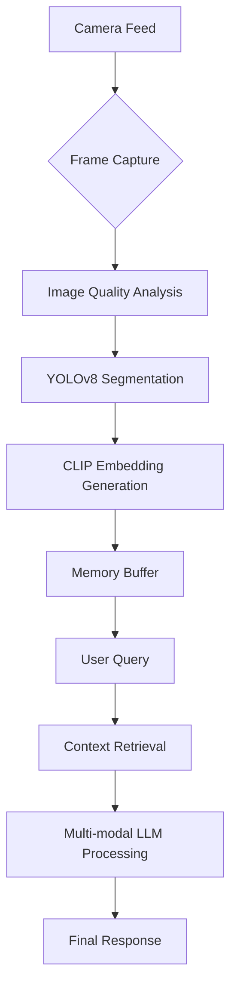

# VisionAI - Assistive Vision System

## Overview

VisionAI is a privacy-focused assistive technology prototype developed in late 2023 (now published for reference, educational and archival purposes) to help visually impaired individuals and those with Alzheimer's disease. The system processes visual input locally to provide contextual understanding and answer user queries without relying on cloud services.

## Key Features

- 🕶️ Real-time visual perception pipeline
- 🔒 100% local processing - no data leaves the device
- 🧠 Context-aware memory buffer system
- 🛡️ Privacy-first architecture
- 🤖 Multi-stage AI processing pipeline

## Technical Components

### Computer Vision Stack

1. **YOLOv8 Object Detection** - Identects and segments objects in visual feed
2. **CLIP Embeddings** - Creates semantic representations of visual data
3. **Image Quality Analysis** - Selects clearest frames from camera feed

### Memory System

- **Short-term Buffer**: Stores recent object detections and embeddings
- **Semantic Search**: CLIP-based similarity matching for contextual recall
- **Multi-modal Storage**: Combines visual embeddings with text descriptions

### Language Processing

1. **Visual Question Answering** - Custom LLM integration for image understanding
2. **Contextual Reasoning** - Combines memory buffer data with user queries
3. **Privacy-Preserving Architecture** - No external API calls or cloud processing

## Workflow

## Deployment Considerations

⚠️ **System Requirements**:

- NVIDIA GPU recommended for real-time processing
- Python 3.10+ with PyTorch
- Local model weights for YOLOv8 and CLIP

🔧 **Configuration**:

1. Install dependencies from requirements.txt
2. Place model weights in /Models directory
3. Configure camera settings in CaptureImage.py

## Project Status

This repository preserves the 2023 prototype system for technical reference and educational purposes. Researchers/developers should note:

- Historical AI/ML implementation patterns
- Early-stage privacy preservation techniques
- Foundational architecture decisions

A redesigned v2.0 is currently in development with:

- Improved memory management
- Enhanced visual processing pipeline
- Expanded accessibility features

## Ethical Considerations

Developed with a focus on:

- User privacy protection
- Assistive technology accessibility
- Transparent AI decision making

